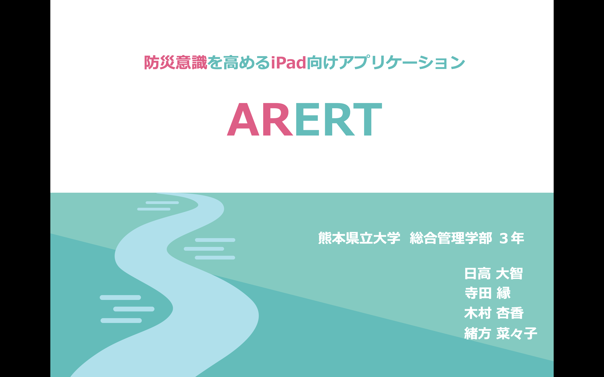

# ARERT

## 製品概要
### 防災 ✖️ Tech

### 背景(製品開発のきっかけ、課題等）
　近年、日本では激甚災害が頻発している。そのような中、私たちが住んでいる熊本県において「熊本豪雨」が発生した。この災害により、球磨川が氾濫し、死亡者が出るほどの被害となった。
 
  しかし、今回の浸水被害はハザードマップで事前に予測されていた。このことから、ハザードマップは防災に有効なコンテンツであることが窺えるが「事前に確認していない」「確認しても理解できていない」などの課題が見つかった。加えて、「子供にも分かりやすい工夫が必要である」という表現上の指摘が挙げられた。
 
このような背景のもと、小学生を対象とした防災コンテンツとして「ARERT」というアプリを開発し、リリースした。※以下URL参照

https://apps.apple.com/us/app/arert/id1512900814
　

今回のハッカソンでは、上記のアプリの拡張機能を開発している。

### 製品説明（具体的な製品の説明）
　ARERTとは、警報を意味する「Alert」と「AR」を掛け合わせた造語である。その名の通り、浸水の危険性をARで伝えることを目的としたアプリとなっている。機能はAR機能を含め、3つ実装している。
 
1.AR機能・・・端末のカメラを利用することで、水面のCGをリアルタイムで合成する。屋内、屋外モードの2パターンを用意しており、20cmごとに水位を調整できる。

2.ハザードマップ機能・・・熊本市が公開している熊本市統合型ハザードマップを実装している。加えて、小学生に向けた、使い方に関する解説も実装している。

3.クイズ機能・・・防災に関するクイズを30問用意している。また、自由に問題を選び解答できる「練習モード」と、ランダムに10問出題し、解答後に点数を表示する「テストモード」の二つを実装している。

今回はAR機能に対して、新機能を実装した。実装内容は以下の2つである。

1.人物認識の追加・・・従来は平面認識のみであったが、人物認識を追加した。これにより、人が水の中に沈んでいる表現が可能となり、「1m浸水すると、腰まで浸かる」といったよりリアリティのある体験を提供できる。

2.浸水深情報の追加・・・国土地理院が提供している「地点別浸水シミュレーション検索システム」のAPIを使用し、現在地の浸水深データを取得している。取得した浸水深データを元に、合成した水面の座標を調整し、自分の今いる場所がどの程度浸水するかを可視化している。また、従来の1mに合成し、20cm毎に水面を調整できるという機能は「通常モード」として定義し、浸水深の表示機能は「予測モード」として定義した。2つのモードはAR機能内で切り替える仕様にしている。

### 特長
####1. 小学生が使いやすいアプリ設計

####2. リアリティ

####3. 正確性

### 解決出来ること
　このアプリを利用することで、小学生に対して、浸水の危険性を伝えることができる。また、今回新たに実装した機能により、よりリアリティのある浸水体験を提供するとともに、身近な場所がどの程度浸水するのかという正確な情報を伝えることができる。
 
### 今後の展望
* UIデザインの設計・・・モード切り替えのスイッチなど、小学生にとってより分かりやすいデザインを設計し直す。また、新たにイラスト素材も作成し、追加する。

* 標高データの取得・・・さらなる正確性を追求するために、現在地から標高データを取得する。取得した標高データと浸水深のデータを掛け合わせ、より正確な位置に水面を合成する。既に、国土地理院のデータから標高データを取得することは完了しているため、AR空間内の座標としてどのように活用するか検討中である。

### 注力したこと（こだわり等）
* UI面・・・浸水深取得中は処理が止まらないように、スイッチ等を変更できないようにしている。

## 開発技術
### 活用した技術
#### API・データ
* 「地点別浸水シミュレーション検索システム」・・・国土地理院が提供しているAPI。JSON形式で取得している。

　　https://suiboumap.gsi.go.jp/pdf/Data-riyo_manual.pdf

#### フレームワーク・ライブラリ・モジュール
* Unity 
* ARFoundation

#### デバイス
* iPad
* 

### 独自技術
#### ハッカソンで開発した独自機能・技術
* JSON形式で取得した浸水深データを、AR空間の座標に変換

#### 製品に取り入れた研究内容（データ・ソフトウェアなど）（※アカデミック部門の場合のみ提出必須）
* 
* 
